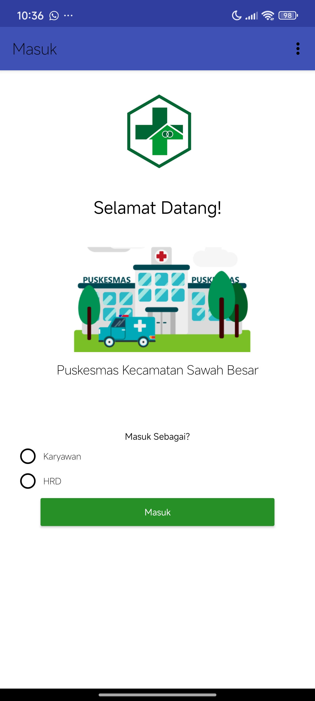

# SDM Puskesmas – Sistem Informasi Absensi dan Kinerja Karyawan

Aplikasi ini dirancang untuk membantu manajemen **SDM Puskesmas** dalam mengelola:
- Kehadiran (absensi)
- Kinerja karyawan
- Jadwal kerja dan shift
- Laporan evaluasi karyawan

## Preview

## 📦 Isi Repo

| File/Folder | Deskripsi |
|-------------|-----------|
| `cgi-bin-public/` | Backend PHP  |
| `SDMPuskesmas_app.apk` | Aplikasi Android siap install |
| `SDM_Puskesmas.aia` | Source code App Inventor (untuk pengembangan lebih lanjut) |
| `assets` | Tampilan aplikasi |
| `.gitignore` | File pengecualian untuk keamanan |
| `README.md` | Dokumentasi ini |

## 🖥 Backend (PHP)

Backend ditulis menggunakan PHP sederhana tanpa framework eksternal, dengan struktur modular seperti:

- `FormKinerja.php` – form input penilaian karyawan
- `ListKetidakhadiran.php` – laporan ketidakhadiran
- `ExportRekap.php` – ekspor rekap absen ke Excel
- `CheckOutAbsen.php` – fitur checkout
- `PerbandinganKaryawanHRD.php` – analisis kinerja antar karyawan

> ⚠️ File yang mengandung informasi sensitif (login, upload handler, log) telah dihapus demi keamanan.

## 📱 Aplikasi Android

Aplikasi Android dibuat menggunakan [MIT App Inventor](https://appinventor.mit.edu/), dan dapat digunakan langsung di perangkat Android.

- **File APK:** `SDMPuskesmas_app.apk` – dapat langsung diinstal
- **File AIA:** `SDM_Puskesmas.aia` – dapat dibuka di MIT App Inventor untuk dikembangkan

## 🛠 Instalasi & Penggunaan

### Backend
1. Upload folder `cgi-bin-public/` ke web server Apache dengan PHP
2. Pastikan konfigurasi database sesuai
3. Sesuaikan URL API pada aplikasi Android jika diperlukan

### Aplikasi Android
- Instal APK di perangkat Android
- Gunakan akun karyawan untuk login (dummy tersedia untuk demo)

## 🚧 Catatan Penting

- Aplikasi ini **hanya menggunakan data dummy**.
- Tidak berisi data asli dari Puskesmas manapun.
- Struktur dan logika ditujukan untuk keperluan demonstrasi dan pengembangan.

## 📄 Lisensi
[MIT License](LICENSE)

